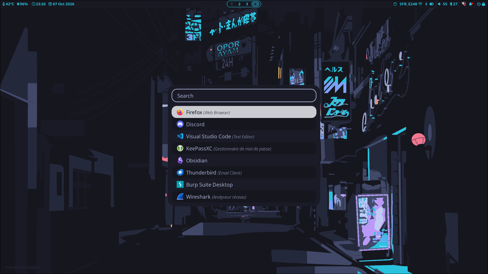
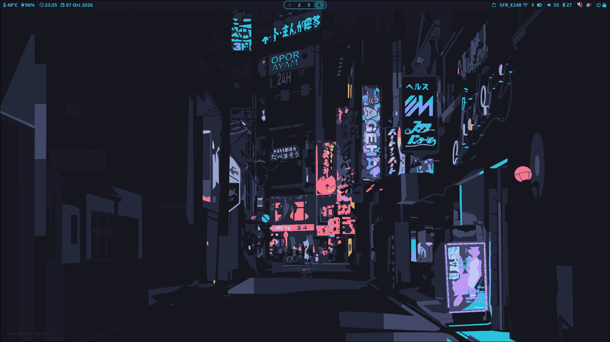
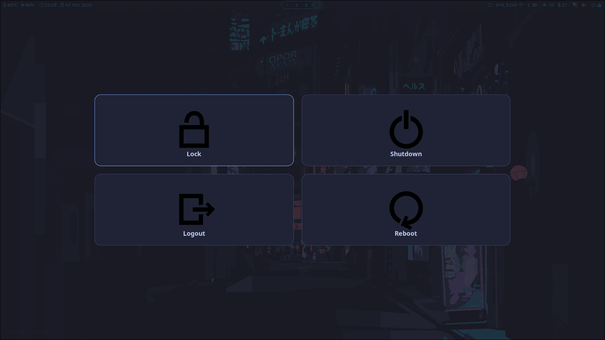
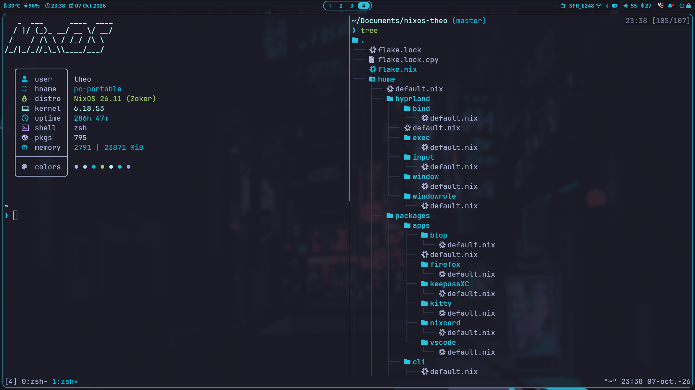
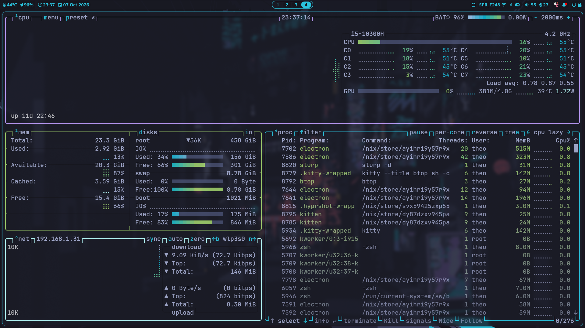
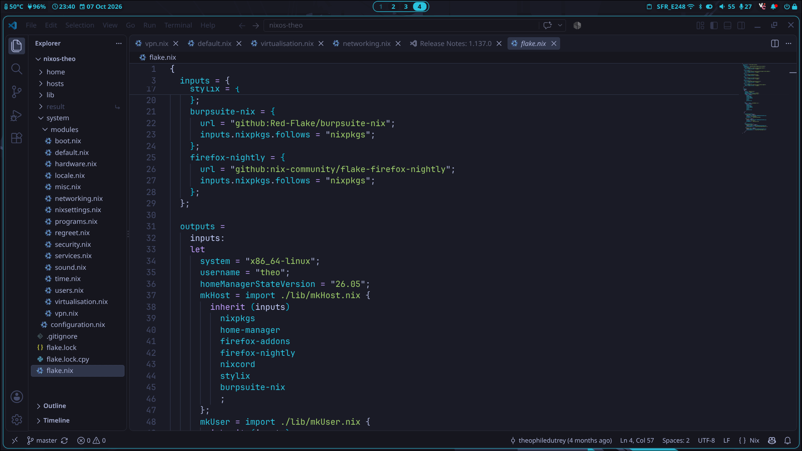
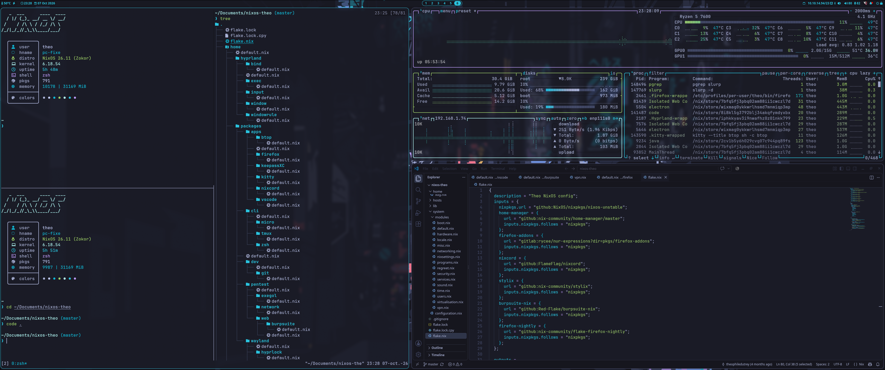

# nixos-theo

Ma configuration NixOS déclarative, gérée via flakes, pour deux machines : `pc-portable` et `pc-fixe`.

## Stack

- **Hyprland** — compositeur Wayland
- **Stylix** — thème unifié (Tokyo Night, JetBrains Mono Nerd Font)
- **Home Manager** — gestion déclarative du dotfiles/user environment
- **Firefox Nightly**, **Nixcord**, **Burpsuite** — via flakes dédiés

## Structure

```
.
├── flake.nix
├── hosts/
│   ├── pc-portable/        # Config + hardware spécifique au portable
│   └── pc-fixe/             # Config + hardware spécifique au fixe
├── system/
│   ├── configuration.nix
│   └── modules/              # boot, networking, security, vpn, virtualisation, sound...
├── home/
│   ├── hyprland/              # binds, exec, input, window, windowrule
│   ├── packages/
│   │   ├── apps/                # btop, firefox, keepassXC, kitty, nixcord, vscode
│   │   ├── cli/                  # micro, tmux, zsh
│   │   ├── dev/                   # git
│   │   ├── pentest/                # exegol, network, web/burpsuite
│   │   └── wayland/                 # hyprlock, mako, rofi, waybar, wlogout, yazi
│   ├── ssh.nix
│   ├── stylix.nix               # thème (Tokyo Night)
│   └── xdg.nix
└── lib/
    ├── mkHost.nix               # builder nixosConfiguration
    ├── mkUser.nix                # builder homeConfiguration
    └── wallpapers/                 # fonds d'écran disponibles
```

## Screenshots

<p align="center">
  <br>
  <br>
  <br>
  <br>
  <br>
  <br>
  
</p>